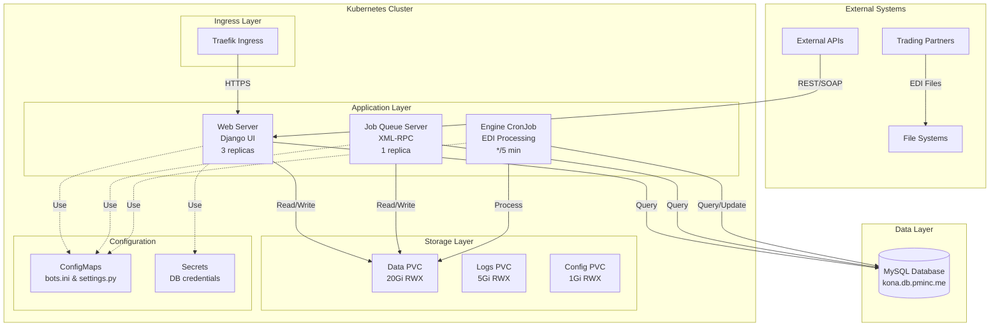

# Bots EDI - Architecture Documentation

## System Architecture

Bots EDI is designed as a distributed, scalable EDI (Electronic Data Interchange) processing system that can run on bare metal, VMs, or containerized in Kubernetes.

## High-Level Architecture



## Component Architecture

### 1. Web Server (Django)

**Purpose**: Web UI for configuration, monitoring, and manual operations

**Technology Stack**:
- Django 2.2+
- Python 3.11
- gunicorn (WSGI server)

**Responsibilities**:
- User authentication and authorization
- Route/channel configuration
- Partner management
- Transaction monitoring
- Manual file uploads
- Health check endpoints

**Scaling**: Horizontal (3 replicas in production)

**Resources**:
- CPU: 100m request, 1000m limit
- Memory: 256Mi request, 1Gi limit

### 2. Engine (EDI Processor)

**Purpose**: Core EDI transformation and routing engine

**Technology Stack**:
- Python 3.11
- Custom EDI parser
- Grammar-based transformation

**Responsibilities**:
- Read incoming EDI files
- Parse using grammar definitions
- Transform to target format
- Route to destinations
- Error handling and retries

**Execution**: CronJob (every 5 minutes) or manual trigger

**Resources**:
- CPU: 200m request, 2000m limit
- Memory: 512Mi request, 2Gi limit

**Process Flow**:
```
1. Scan input directories
2. Identify message format
3. Parse with grammar
4. Apply transformation mapping
5. Generate output format
6. Write to output location
7. Update transaction database
8. Handle errors/retries
```

### 3. Job Queue Server

**Purpose**: Background job processing via XML-RPC

**Technology Stack**:
- Python 3.11
- XML-RPC server
- Custom job queue

**Responsibilities**:
- Accept job submissions
- Queue management
- Asynchronous processing
- Job status tracking

**Scaling**: Singleton (1 replica, not horizontally scalable)

**Resources**:
- CPU: 100m request, 500m limit
- Memory: 256Mi request, 512Mi limit

### 4. Directory Monitor (Optional)

**Purpose**: File system watcher for automatic processing

**Technology Stack**:
- Python 3.11
- inotify/watchdog

**Responsibilities**:
- Monitor directories for new files
- Trigger engine processing
- Handle file events

**Note**: Often replaced by CronJob in Kubernetes environments

## Data Flow

### Inbound EDI Processing

```
1. Partner → FTP/SFTP/API → Input Directory
2. Engine (CronJob) → Scans input directory
3. Engine → Parses EDI file with grammar
4. Engine → Validates message structure
5. Engine → Applies transformation mapping
6. Engine → Generates output format
7. Engine → Writes to output directory
8. Engine → Updates database transaction log
9. Output Directory → Delivery to destination
```

### Outbound EDI Generation

```
1. Internal System → API/Database → Bots EDI
2. Web UI/API → Creates outbound transaction
3. Engine → Retrieves data from source
4. Engine → Applies grammar for target format
5. Engine → Generates EDI file
6. Engine → Writes to partner directory
7. Partner → Polls/receives file
```

## Storage Architecture

### Persistent Volume Strategy

**ReadWriteMany (RWX) Required**: Multiple pods need simultaneous access

#### 1. Data PVC (20Gi)
- **Mount**: `/home/bots/.bots`
- **Contents**:
  - Input/output directories
  - Processing queues
  - Archive files
  - Partner configurations
- **Backup**: Daily
- **Retention**: 90 days

#### 2. Logs PVC (5Gi)
- **Mount**: `/home/bots/.bots/env/default/botssys/logging`
- **Contents**:
  - Application logs
  - Engine processing logs
  - Error logs
  - Audit trails
- **Rotation**: 30 days
- **Aggregation**: Optional (ELK stack)

#### 3. Config PVC (1Gi)
- **Mount**: `/home/bots/.bots/env/default/config`
- **Contents**:
  - Runtime configuration backup
  - User-uploaded grammars
  - Custom mappings
- **Backup**: With data PVC

### Storage Classes

**Supported**:
- NFS (recommended for RWX)
- CephFS
- Longhorn
- GlusterFS

**Not Supported**:
- Local-path (no RWX support)
- HostPath (no RWX support)

## Database Architecture

### Schema Overview

**Django Managed Tables**:
- `auth_*` - Authentication/authorization
- `django_*` - Django framework tables
- `bots_*` - Application tables (see below)

**Bots-Specific Tables**:
- `routes` - Message routing rules
- `channels` - Communication channels
- `translations` - Format transformations
- `partners` - Trading partners
- `ta` - Transaction records
- `filereport` - File processing reports
- `mutex` - Locking mechanism
- `persist` - Persistent data store
- `ccode`, `ccodetrigger` - Code tables

### Database Operations

**Connection Pooling**: Django CONN_MAX_AGE

**Transactions**: ACID compliance required

**Backup Strategy**:
- Full backup: Daily
- Transaction log: Continuous (if MySQL binary logging enabled)
- Retention: 30 days full, 7 days transaction logs

## Configuration Management

### ConfigMap Strategy

**Base ConfigMaps** (immutable, in Git):
- `bots-config-ini` - Complete bots.ini (300 lines)
- `bots-config-settings` - Django settings.py

**Environment ConfigMaps** (generated by Kustomize):
- `bots-env-config` - Environment-specific variables

### Secret Management

**Secret Types**:
1. Database credentials
2. Django SECRET_KEY
3. Optional: SMTP, API keys

**Management Options**:
- Sealed Secrets (recommended for GitOps)
- External Secrets Operator (Vault integration)
- Manual (current PM Inc approach)

### Configuration Precedence

```
1. Environment variables (highest priority)
2. ConfigMap-mounted files
3. Image-embedded defaults (lowest priority)
```

## Health Check Architecture

### Endpoints

#### Web Server (HTTP)
- `/health/ping` - Simple connectivity (200 OK)
- `/health/live` - Liveness probe (process alive)
- `/health/ready` - Readiness probe (can serve traffic)
- `/health/startup` - Startup probe (fully initialized)

#### Non-Web Services (CLI)
```bash
python /usr/local/bots/scripts/healthcheck.py --check <live|ready|startup>
```

**Exit Codes**:
- 0: Healthy
- 1: Unhealthy
- 2: Configuration error

### Probe Configuration

**Liveness** (restart if failing):
- Initial delay: 30s
- Period: 30s
- Failure threshold: 3

**Readiness** (remove from load balancer if failing):
- Initial delay: 10s
- Period: 10s
- Failure threshold: 3

**Startup** (allow time to initialize):
- Initial delay: 0s
- Period: 10s
- Failure threshold: 30 (5 minutes max)

## Network Architecture

### Kubernetes Services

**bots-webserver**:
- Type: ClusterIP
- Port: 8080
- Protocol: TCP
- Selectors: `app=bots-edi, component=webserver`

### Ingress Configuration

**Controller**: Traefik

**TLS**: Enabled with cert-manager

**Routing**:
- Host: `bots-edi.pminc.me`
- Path: `/` → `bots-webserver:8080`

### Network Policies (Optional)

```yaml
# Allow webserver ingress
- from:
  - namespaceSelector:
      matchLabels:
        name: traefik
  ports:
  - port: 8080

# Allow internal communication
- from:
  - podSelector:
      matchLabels:
        app: bots-edi
```

## Security Architecture

### Authentication

**Web UI**:
- Django authentication
- Session-based
- CSRF protection

**API**:
- Token-based (optional)
- Basic auth (optional)

### Authorization

**Django Permissions**:
- View/Add/Change/Delete permissions per model
- Group-based access control
- Superuser privilege

### Container Security

**Non-Root User**:
- UID: 1000 (bots)
- GID: 1000 (bots)

**Read-Only Root Filesystem** (partial):
- Application code: Read-only
- Data directories: Read-write mounts

**Security Context**:
```yaml
securityContext:
  runAsNonRoot: true
  runAsUser: 1000
  runAsGroup: 1000
  fsGroup: 1000
  capabilities:
    drop:
      - ALL
```

### Secrets Security

- Never stored in Git (unencrypted)
- Sealed Secrets for GitOps
- External secret management integration
- Regular rotation recommended

## Scalability

### Horizontal Scaling

**Webserver**: ✅ Scalable
- Stateless (sessions in DB)
- Load balanced via service
- Scale to 3-10 replicas

**Job Queue**: ❌ Not scalable
- Singleton by design
- State stored in memory
- Use external queue for HA (future enhancement)

**Engine**: ⚠️ Limited scaling
- File-based locking prevents conflicts
- Can run multiple if operating on different directories
- CronJob concurrency policy: Forbid

### Vertical Scaling

Increase resource limits based on workload:
- CPU: 100m → 2000m
- Memory: 256Mi → 4Gi

### Performance Optimization

**Database**:
- Connection pooling
- Query optimization
- Index tuning

**Engine**:
- Batch processing
- Parallel transformation (if safe)
- Caching parsed grammars

**Storage**:
- Fast NFS or distributed filesystem
- SSD for database
- Archive old transactions

## High Availability

### Redundancy

**Webserver**: 3 replicas (active-active)

**Job Queue**: 1 replica (consider external queue for HA)

**Engine**: CronJob (self-healing)

**Database**: External MySQL (managed, HA configuration)

### Failure Scenarios

| Failure | Impact | Recovery |
|---------|--------|----------|
| Webserver pod crash | Minimal (other replicas serve) | Kubernetes auto-restart |
| Job Queue crash | Jobs in queue lost | Restart, resubmit jobs |
| Engine job failure | Delayed processing | Next CronJob run retries |
| Database down | Complete outage | Database HA failover |
| PVC unavailable | Data access failure | Storage layer recovery |
| Node failure | Pod eviction | Reschedule on healthy node |

### Disaster Recovery

**RTO** (Recovery Time Objective): 1 hour

**RPO** (Recovery Point Objective): 15 minutes

**Backup Strategy**:
1. Database: Automated daily backups
2. PVC: Velero or CSI snapshots
3. Configuration: Git repository

## Monitoring and Observability

### Metrics (Recommended)

**Application**:
- Transaction count
- Processing time
- Error rate
- Queue depth

**Infrastructure**:
- Pod CPU/memory usage
- PVC capacity
- Database connections
- Network traffic

**Tools**:
- Prometheus + Grafana
- Kubernetes metrics-server
- Custom Django metrics

### Logging

**Application Logs**:
- Location: `/home/bots/.bots/env/default/botssys/logging`
- Format: Text files
- Rotation: 30 days

**Aggregation** (Recommended):
- Fluentd/Fluent Bit → Elasticsearch
- Loki (Grafana Loki)
- CloudWatch/Stackdriver

### Tracing

**Django Debug Toolbar** (development)

**APM Tools** (optional):
- New Relic
- Datadog
- Elastic APM

## Future Enhancements

### Planned

1. **Redis-based Job Queue**: Replace singleton job queue
2. **Horizontal Engine Scaling**: Shard by partner/route
3. **REST API**: Modern API alongside XML-RPC
4. **Webhook Support**: Event-driven processing
5. **Message Broker**: Kafka/RabbitMQ integration

### Under Consideration

1. **Microservices Split**: Separate UI from engine
2. **Serverless Functions**: AWS Lambda for transformations
3. **Multi-tenancy**: Isolate customer data
4. **Real-time Monitoring**: WebSocket-based dashboards

## Technology Decisions

See [decision-records/](./decision-records/) for detailed ADRs:
- [ADR-001: Multi-Service Container Architecture](decision-records/001-multi-service-architecture.md)
- [ADR-002: Kustomize for Multi-Environment](decision-records/002-kustomize-overlays.md)
- [ADR-003: RWX Storage Requirement](decision-records/003-rwx-storage.md)
- [ADR-004: Health Check Implementation](decision-records/004-health-checks.md)

## References

- [Kubernetes Deployment Guide](kubernetes-deployment.md)
- [Development Guide](development.md)
- [Operations Runbook](operations-runbook.md)
- [Official Bots Documentation](https://bots.readthedocs.io)
